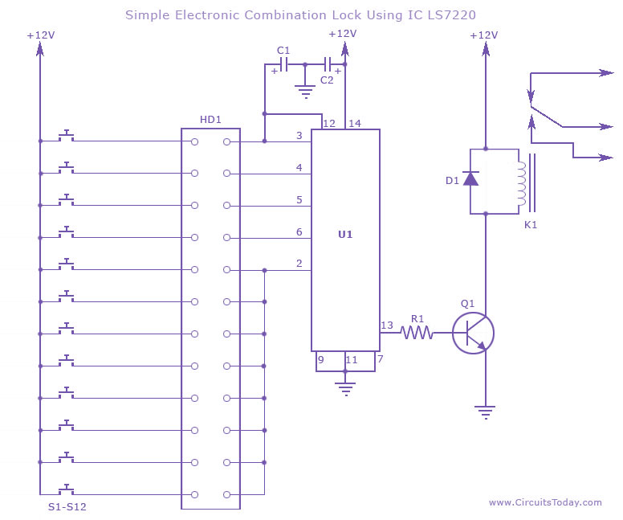
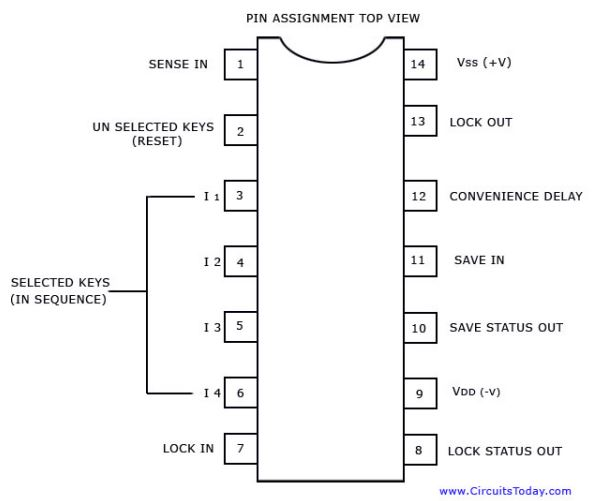
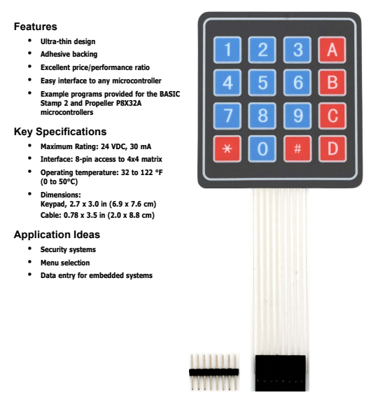
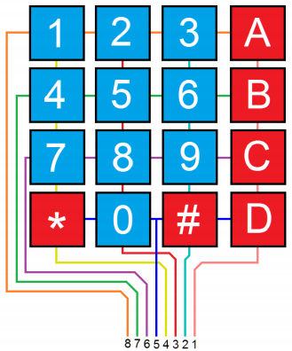

# Electronic-Combinational-Lock
It is a simple electronic combination lock that uses IC LS 7220. This circuit can be used to activate a relay for controlling (on &amp; off) any device when a preset combination of 4 digits are pressed. The circuit can be operated from 5V to 12V.

# Circuit Diagram:

# LS-7220 PINOUT

# Working:
To set the combination connect the appropriate switches to pin 3,4,5 and 6 of the IC through the header. As an example if S1 is connected to pin 3, S2 to pin 4, S3 to pin 5, S4 to pin 6 of the IC, the combination will be 1234. This way we can create any 4 digit combinations. Then connect the rest of the switches to pin 2 of IC. This will cause the IC to reset if any invalid key is pressed, and entire key code has to be reentered.
When the correct key combination is pressed the output (relay) will be activated for a preset time determined by the capacitor C1. Here it is set to be 6S. Increase C1 to increase on time.
For the key pad, arrange switches in a 3X4 matrix on a PCB. Write the digits on the keys using a marker or leave them as it is.

# KeyPad (4x4 Matrix Membrane Keypad (#27899) 
This 16-button keypad provides a useful human interface component for microcontroller projects.
Convenient adhesive backing provides a simple way to mount the keypad in a variety of applications.

## KeyPad wiring can be seen in the image below

A more detailed <a href="27899-4x4-Matrix-Membrane-Keypad-v1.2.pdf">PDF</a>  on Key Pad.

# Components Used:

<ul>
  <li> C1              1   1µF 25V Electrolytic Capacitor   </li>
  <li> C2              1    220µF 25V Electrolytic Capacitor </li>
  <li>    R1              1    2.2KΩ 1/4W Resistor  </li>
  <li>    Q1              1    2N3904 NPN Transistor    2N2222   </li>
  <li>    D1              1    1N4148 Rectifier Diode    1N4001-1N4007  </li>
  <li>    K1              1    12V SPDT Relay    Any appropriate relay with 12V coil  </li>
  <li>    U1             1     LS7220 Digital Lock IC  </li>
  <li>    S1-S12    12    SPST Momentary Pushbutton  </li>
  <li>   HD1          1    12 Position Header    </li>
</ul>
